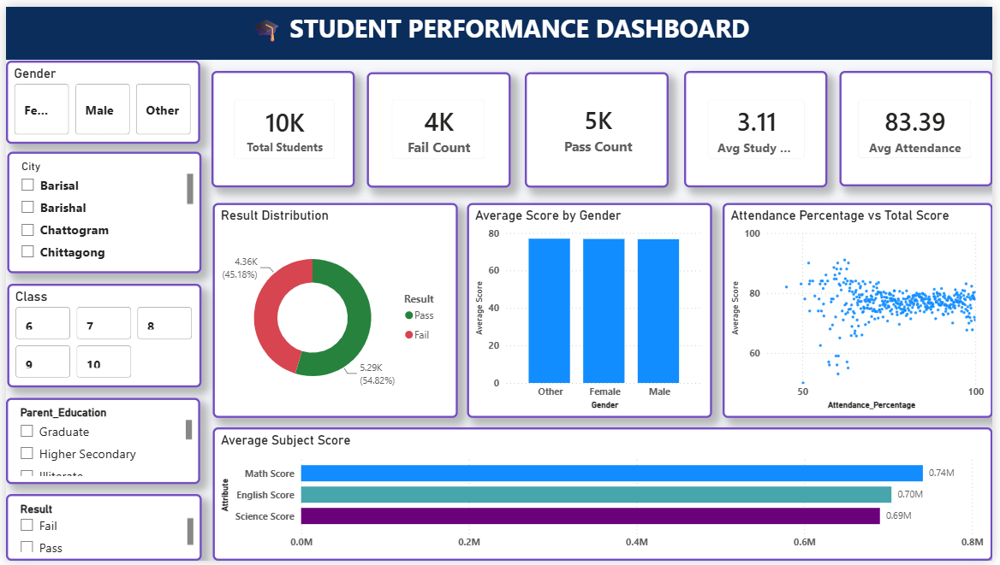

# 📊 Student Performance Dashboard

## About the Project
This project focuses on analyzing student academic performance using Microsoft Power BI. The objective is to identify factors affecting student performance, such as attendance, study hours, subject scores, gender, class, city, internet access, and parent education. The dashboard provides interactive visualizations that help users explore trends and gain meaningful insights from the data.

---

## Data Collection
- Dataset: Student Performance Dataset
- Total Records: 9,851 students
- File Format: CSV
- The dataset contains student demographic information, attendance percentage, study hours, subject scores, parent education, internet access, and examination results.

---

## Phase 1: Data Preprocessing in Microsoft Excel

The dataset was cleaned and preprocessed in Microsoft Excel before importing it into Power BI. The following data cleaning steps were performed:

### Data Cleaning Report

- **Removed Duplicate Records**
  - Removed **150 duplicate records** to ensure each student record is unique.

- **Standardized Student Names**
  - Applied the **PROPER()** and **TRIM()** functions to correct capitalization and remove extra spaces in the **Name** column.

- **Validated Age Values**
  - Identified invalid age values (less than 0 or greater than 22) using:
    ```excel
    =IF(OR(C2<0,C2>22),"",C2)
    ```
  - Replaced invalid values with blanks and filled the missing values using the **mean age**.

- **Standardized Gender Values**
  - Standardized gender entries by replacing:
    - **M, MALE, male → Male**
    - **F, FEMALE, female → Female**
    - **other → Other**

- **Standardized City Names**
  - Applied the **PROPER()** and **TRIM()** functions to ensure consistent city names.

- **Standardized Class Values**
  - Corrected inconsistent class entries using the **Find and Replace** feature.

- **Validated Attendance Percentage**
  - Ensured attendance values were between **0 and 100** using:
    ```excel
    =IF(OR(G2<0,G2>100),"",G2)
    ```
  - Replaced invalid values with blanks and filled missing values using the **average attendance**.

- **Validated Study Hours**
  - Ensured study hours were within the valid range (**0–24 hours**) using:
    ```excel
    =IF(OR(H2<0,H2>24),"",H2)
    ```
  - Replaced invalid values with blanks and filled missing values using the **median study hours**.

- **Cleaned Subject Score Columns**
  - Removed negative values from **Math**, **Science**, and **English** score columns.
  - Replaced **"Absent"** entries with **0**.
  - Filled missing values using the **median score** of each respective subject.

- **Standardized Parent Education**
  - Applied the **PROPER()** and **TRIM()** functions.
  - Replaced blank cells and **"N/A"** values with **"Unknown"**.

- **Standardized Internet Access**
  - Replaced blank cells and **"N/A"** values with **"Unknown"** to maintain consistency.

### Challenges Faced

- Handling duplicate student records.
- Correcting inconsistent text values across multiple categorical columns.
- Identifying and replacing invalid numerical values.
- Selecting appropriate statistical methods (mean or median) for imputing missing values.
- Ensuring the dataset was clean, accurate, and ready for visualization in Power BI.

---

## Phase 2: Dashboard Development in Power BI

An interactive dashboard was developed using Microsoft Power BI to visualize student performance.

### Dashboard Features
- KPI Cards
  - Total Students
  - Pass Count
  - Fail Count
  - Average Attendance
  - Average Study Hours
- Interactive Slicers
  - Gender
  - City
  - Class
  - Parent Education
  - Internet Access
  - Result
- Result Distribution (Donut Chart)
- Average Score by Gender
- Attendance Percentage vs Total Score (Scatter Plot)
- Average Subject Score
- Study Hours vs Average Total Score
- Average Score by Parent Education
- Internet Access vs Result
- Students by City
- Result by Class
- Student Details Table

---

## DAX Measures Used

```DAX
Total Students = COUNT(StudentData[Student_ID])

Pass Count =
CALCULATE(
    COUNT(StudentData[Student_ID]),
    StudentData[Result] = "Pass"
)

Fail Count =
CALCULATE(
    COUNT(StudentData[Student_ID]),
    StudentData[Result] = "Fail"
)

Average Attendance =
AVERAGE(StudentData[Attendance_Percentage])

Average Study Hours =
AVERAGE(StudentData[Study_Hours_per_day])

Average Score =
AVERAGE(StudentData[Total_Score])
```

Additional calculated columns were also created for grouping study hours into categories for analysis.

---

## Dashboard Screenshots

### Dashboard Page



### Analysis Page


---

## Key Findings

- Students with higher attendance generally achieve better academic performance.
- Increased study hours show a positive relationship with average scores.
- Students with internet access tend to have a higher pass percentage.
- Parent education has a moderate influence on student performance.
- Student performance varies across different cities and classes.
- Female, male, and other gender groups have relatively similar average scores.

---

## Suggestions

- Encourage regular attendance to improve academic performance.
- Promote effective study habits among students.
- Improve internet accessibility for students to support learning.
- Provide additional academic support for students with low attendance.
- Monitor performance trends across cities and classes to identify areas needing improvement.

---

## Tools Used

- Microsoft Excel
- Microsoft Power BI

---

## Repository Contents

- Raw Student Dataset (.csv)
- Preprocessed Excel File (Phase 1)
- Power BI Dashboard (.pbix)
- Dashboard Screenshots
- README.md

---

## Author

**Soniya V S**
